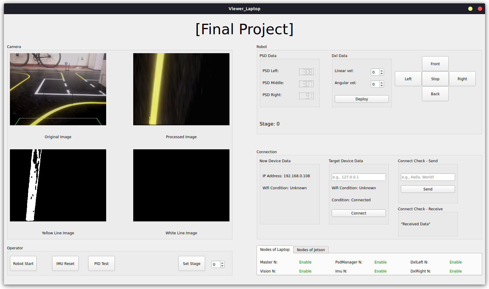

# ros2_udp_bridge
## Description
This package provides a complete solution for controlling the TurtleBot3 using ROS2, C++, and Qt.


## Built With
- Client

    - Qt: For creating the user interface and visualizing TurtleBot3 states.

- Server
    - C++: Core logic for ROS2 nodes and algorithms.

- Framework
    - ROS2: For communication between TurtleBot3 and external devices.

## Prerequisites
- Hardware Requirements:

    - TurtleBot3

    - Laptop/PC running Ubuntu

- Software Requirements:

    - ROS2 (e.g., Humble, Foxy)
    - Qt Creator
    - C++ Compiler

## Installation
1. Clone the repository:
```bash
cd {workspace}
git clone https://github.com/kinesis19/ros2-udp-bridge.git
cd ros2-udp-bridge
```
2. Build the package:
```bash
colcon build
```

3. Source the workspace:
```bash
source ~/{workspace name}/ros2-udp-bridge/install/setup.bash
```

4. Run the package:
```bash
ros2 run udp_connection udp_connection laptop
```

## Interface


## How to run Autonomous driving mode
1. Run a package.
2. The first time you run the package, it will automatically set up and operate in autonomous mode.
3. To exit autonomous mode, enter the number “0” in the spinBox located to the right of the “Set Stage” button, press the “Set Stage” button, and then press the “Robot Start” or “Robot Stop” button.

## How to run Manual driving mode
1. To exit autonomous mode, enter the number “0” in the spinBox located to the right of the “Set Stage” button, press the “Set Stage” button, and then press the “Robot Start” or “Robot Stop” button.
2. Press the “STOP” button on the arrow button in the upper right corner.
3. You can control the robot with the W, A, S, and D keys, and if you pressed the “STOP” key in the previous step, you can stop the robot's movement with the “SPACE” key.


## License
This project is licensed under the MIT License.

## Team Members
#### Intern of IntelligenceTeam (19th)

- Intern 19th Beomsuchoi <a href="https://github.com/beomsuchoi"></a>

- Intern 19th Jammay <a href="https://github.com/jammay123"></a>

- Intern 19th Kinesis <a href="https://github.com/kinesis19"></a>
